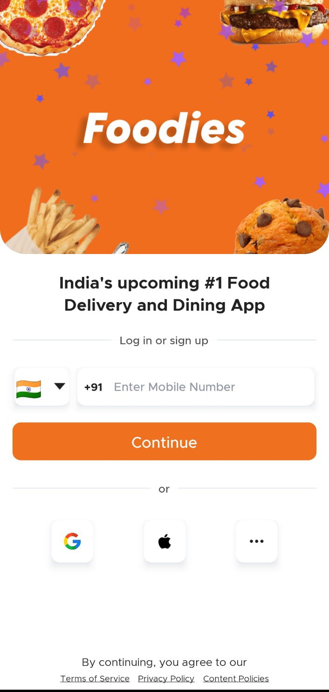
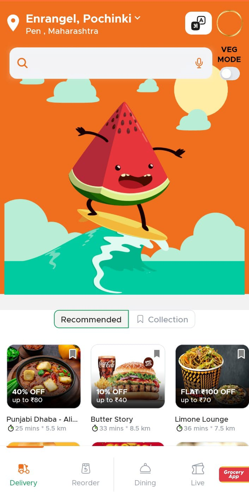
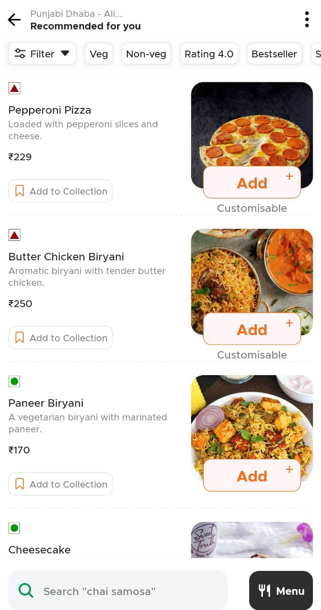
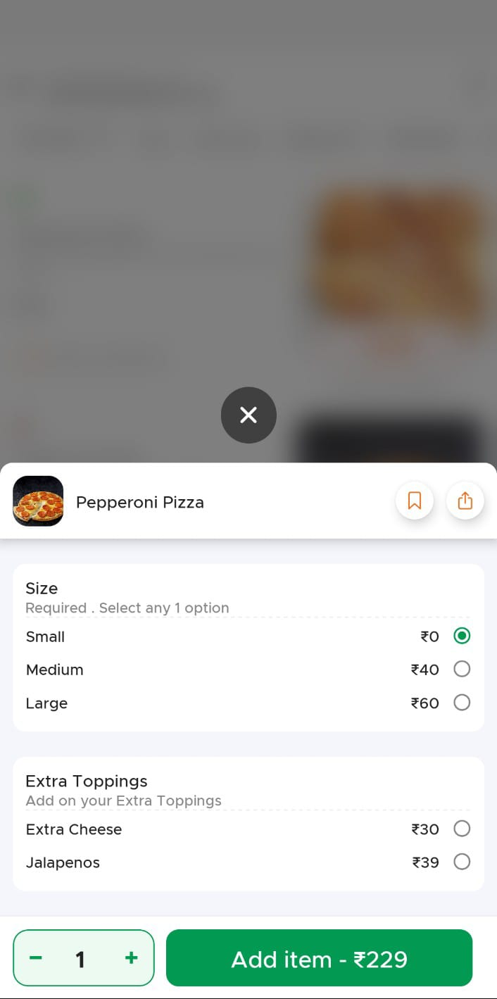
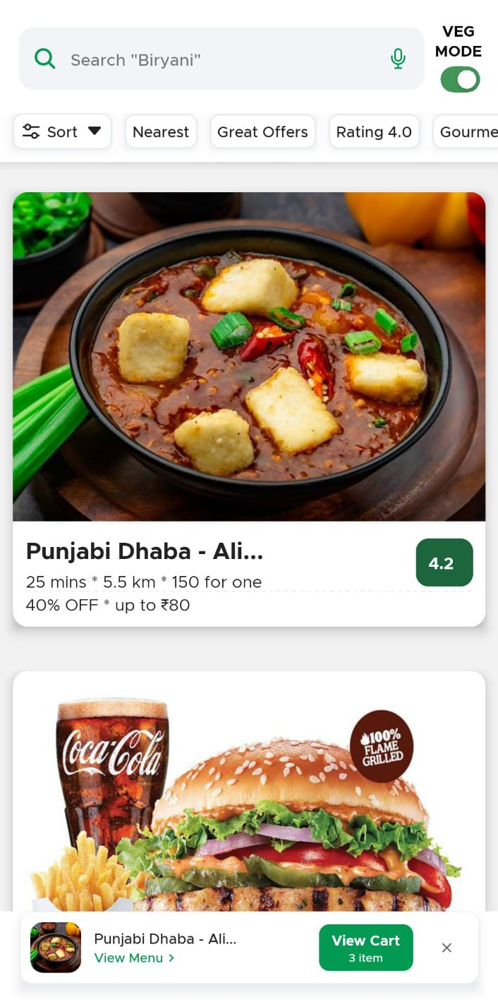

<div align="center">
  <h1>🍕 Food Delivery App</h1>
  <p>A modern, feature-rich food delivery application built with React Native</p>
  
  <div>
    
    
    
    
  </div>
</div>
  <br />
  

  
  <!-- Screenshots -->
  <h2>📸 App Screenshots</h2>
  <p>Here’s a glimpse of the app in action 👇</p>
  
  <div align="center">
    <table>
      <tr>
        <td></td>
        <td></td>
        <td></td>
      </tr>
      <tr>
        <td align="center"><b>🔐 Login</b></td>
        <td align="center"><b>🏠 Home</b></td>
        <td align="center"><b>🍽️ Menu</b></td>
      </tr>
      <tr>
        <td></td>
        <td></td>
        <td></td>
      </tr>
      <tr>
        <td align="center"><b>⚙️ Customisation</b></td>
        <td align="center"><b>🛒 Cart</b></td>
        <td align="center"><b>💳 Checkout</b></td>
      </tr>
    </table>
  </div>
</div>
  
## ✨ Features

🎯 **Core Features:**
- 🏠 **Home Screen** - Browse featured restaurants and cuisines
- 🏪 **Restaurant Details** - Detailed restaurant information and menu
- 🛒 **Cart Management** - Add, remove, and modify cart items
- 💳 **Checkout Process** - Seamless order placement and payment
- 📱 **Authentication** - User login and registration
- 🚚 **Live Tracking** - Real-time order tracking
- 🔄 **Reorder** - Quick reordering from order history
- 🍽️ **Dining Options** - Delivery and dine-in options

🎨 **UI/UX Features:**
- 🌟 **Smooth Animations** - Lottie animations and Reanimated
- 📱 **Responsive Design** - Optimized for all screen sizes
- 🎭 **Modern UI** - Beautiful gradients and blur effects
- 🔧 **Custom Components** - Reusable UI components
- 📊 **Loading States** - Engaging loading animations

## 🛠️ Tech Stack

### 📱 **Frontend**
- **React Native** `0.78.0` - Cross-platform mobile development
- **TypeScript** `5.0.4` - Type-safe JavaScript
- **React Navigation** `7.x` - Navigation library
- **React Native Unistyles** - Styling solution

### 🗄️ **State Management**
- **Redux Toolkit** `2.6.1` - State management
- **Redux Persist** `6.0.0` - Persistent state
- **React Redux** `9.2.0` - React bindings for Redux
- **MMKV** `3.2.0` - Fast key-value storage

### 🎨 **UI & Animation**
- **Lottie React Native** `7.2.2` - Beautiful animations
- **React Native Reanimated** `3.17.1` - Smooth animations
- **React Native Animated Numbers** `0.6.3` - Number animations
- **React Native Linear Gradient** `2.8.3` - Gradient backgrounds
- **React Native Blur** `4.4.1` - Blur effects
- **React Native Vector Icons** `10.2.0` - Icon library
- **React Native SVG** `15.11.2` - SVG support

### 🔧 **Utilities**
- **Axios** `1.8.3` - HTTP client
- **React Native Gesture Handler** `2.24.0` - Touch gestures
- **React Native Safe Area Context** `5.3.0` - Safe area handling
- **UUID** `11.1.0` - Unique identifiers

## 📁 Project Structure

```
📦 FoodDelivery/
├── 📂 src/
│   ├── 📂 assets/          # Images, fonts, animations
│   │   ├── 📂 animations/  # Lottie animations
│   │   ├── 📂 fonts/       # Custom fonts
│   │   ├── 📂 icons/       # App icons
│   │   ├── 📂 images/      # Static images
│   │   └── 📂 tabicons/    # Tab navigation icons
│   ├── 📂 components/      # Reusable components
│   │   ├── 📂 checkout/    # Checkout components
│   │   ├── 📂 global/      # Global components
│   │   ├── 📂 home/        # Home screen components
│   │   ├── 📂 list/        # List components
│   │   ├── 📂 model/       # Modal components
│   │   ├── 📂 restaurant/  # Restaurant components
│   │   └── 📂 ui/          # UI components
│   ├── 📂 features/        # Feature modules
│   │   ├── 📂 auth/        # Authentication
│   │   ├── 📂 checkout/    # Checkout process
│   │   ├── 📂 delivery/    # Delivery tracking
│   │   ├── 📂 dining/      # Dining options
│   │   ├── 📂 live/        # Live tracking
│   │   ├── 📂 reorder/     # Reorder functionality
│   │   ├── 📂 restaurant/  # Restaurant features
│   │   └── 📂 tabs/        # Tab navigation
│   ├── 📂 navigation/      # Navigation configuration
│   ├── 📂 states/          # Redux store & reducers
│   │   └── 📂 reducers/    # Redux reducers
│   ├── 📂 types/           # TypeScript definitions
│   ├── 📂 unistyles/       # Styling configurations
│   └── 📂 utils/           # Utility functions
├── 📂 android/             # Android specific code
├── 📂 ios/                 # iOS specific code
└── 📄 App.tsx              # Root component
```

## 🚀 Getting Started

### 📋 Prerequisites

Before running this project, make sure you have:

- ✅ [Node.js](https://nodejs.org/) (>= 18.0.0)
- ✅ [React Native CLI](https://reactnative.dev/docs/environment-setup)
- ✅ [Android Studio](https://developer.android.com/studio) (for Android development)
- ✅ [Xcode](https://developer.apple.com/xcode/) (for iOS development, macOS only)
- ✅ [JDK 17](https://www.oracle.com/java/technologies/javase/jdk17-archive-downloads.html)

### 🔧 Installation

1. **Clone the repository**
   ```bash
   git clone <your-repo-url>
   cd FoodDelivery
   ```

2. **Install dependencies**
   ```bash
   npm install
   ```

3. **iOS Setup** (macOS only)
   ```bash
   # Install CocoaPods
   bundle install
   
   # Install iOS dependencies
   cd ios && bundle exec pod install && cd ..
   ```

### ▶️ Running the App

1. **Start Metro bundler**
   ```bash
   npm start
   ```

2. **Run on Android**
   ```bash
   npm run android
   ```

3. **Run on iOS** (macOS only)
   ```bash
   npm run ios
   ```

### 📦 Building for Production

**Android APK:**
```bash
npm run generate-apk
```

**iOS Archive:**
```bash
# Open in Xcode and archive
open ios/FoodDelivery.xcworkspace
```

## 🧪 Testing

Run the test suite:
```bash
npm test
```

Run linting:
```bash
npm run lint
```

## 🎯 Development

### 🔄 Hot Reload
The app supports Fast Refresh. Save your changes and see them instantly!

### 🐛 Debugging
- **Android**: Shake device or `Ctrl/Cmd + M` → Debug
- **iOS**: Shake device or `Cmd + D` → Debug
- **Flipper**: Advanced debugging with network inspector

## 📱 Supported Platforms

| Platform | Support | Version |
|----------|---------|----------|
| 🤖 Android | ✅ | API 21+ |
| 🍎 iOS | ✅ | iOS 12+ |

## 🤝 Contributing

We welcome contributions! Here's how you can help:

1. 🍴 Fork the repository
2. 🌿 Create your feature branch (`git checkout -b feature/amazing-feature`)
3. ✅ Commit your changes (`git commit -m 'Add amazing feature'`)
4. 📤 Push to the branch (`git push origin feature/amazing-feature`)
5. 🎯 Open a Pull Request

## 📄 License

This project is licensed under the MIT License - see the [LICENSE](LICENSE) file for details.

## 🙏 Acknowledgments

- Built with ❤️ using React Native
- Icons by [React Native Vector Icons](https://github.com/oblador/react-native-vector-icons)
- Animations by [Lottie](https://lottiefiles.com/)
- UI inspiration from modern food delivery apps

## 📞 Support

If you have any questions or need help, feel free to:
- 🐛 [Open an issue](../../issues)
- 💬 Start a discussion
- 📧 Contact the maintainers

---

<div align="center">
  <p>Made with ❤️ for food lovers everywhere</p>
  <p>⭐ Star this repo if you like it!</p>
</div>
